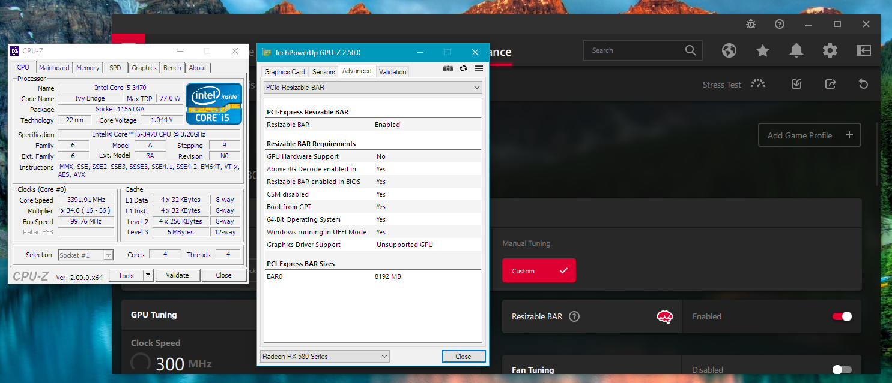

<h1 align="center">ReBarUEFI</h1>
<p align="center">
<a href="https://github.com/xCuri0/ReBarUEFI/actions/workflows/ReBarDxe.yml"></a>
<a href="https://github.com/xCuri0/ReBarUEFI/actions/workflows/ReBarState.yml"></a>
<a href="https://github.com/xCuri0/ReBarUEFI/releases/"></a>
</p>
<p align="center">
A UEFI DXE driver to enable Resizable BAR on systems which don't support it officially. This provides performance benefits and is even <a href="https://www.intel.com/content/www/us/en/support/articles/000092416/graphics.html">required</a> for Intel Arc GPUs to function optimally.
</p>




## Requirements
* (optional) 4G Decoding enabled. See wiki page [Enabling hidden 4G decoding](https://github.com/xCuri0/ReBarUEFI/wiki/Enabling-hidden-4G-decoding) if you can't find an option for it. **Without 4G Decoding you will be limited to 1GB BAR and in some cases 512MB you can try to increase this upto 2GB by reducing TOLUD**
* (optional) BIOS support for Large BARs. Patches exist to fix most issues relating to this

## Usage
Follow the wiki guide [Adding FFS module](https://github.com/xCuri0/ReBarUEFI/wiki/Adding-FFS-module) and continue through the steps. It covers adding the module and the additional modifications needed if required.

Once running the modified firmware make sure that **4G decoding is enabled and CSM is off**.

Next run **ReBarState** which can be found in [Releases](https://github.com/xCuri0/ReBarUEFI/releases) (if you're on Linux build with CMake) and set the Resizable BAR size. In most cases you should be able to use ```32``` (unlimited) without issues but you might need to use a smaller BAR size if ```32``` doesn't work

 **If Resizable BAR works for you reply to [List of working motherboards](https://github.com/xCuri0/ReBarUEFI/issues/11) so I can add it to the list.** Most firmware will accept unsigned/patched modules with Secure Boot on so you won't have any problems running certain games.

If you have any issues after enabling Resizable BAR see [Common Issues (and fixes)](https://github.com/xCuri0/ReBarUEFI/wiki/Common-issues-(and-fixes))

## How it works
The module is added to the UEFI firmware's DXE volume so it gets executed on every boot. The ReBarDxe module replaces the function ```PreprocessController``` of ```PciHostBridgeResourceAllocationProtocol``` with a function that checks for Resizable BAR capability and then sets it to the size from the ```ReBarState``` NVRAM variable after running the original function.

The new ```PreprocessController``` function later gets called during PCI enumeration by the ```PciBus``` module which will detect the new BAR size and allocate it accordingly.

## AliExpress X99 Tutorial by Miyconst
[](http://www.youtube.com/watch?v=vcJDWMpxpjEE "Resizable BAR on LGA 2011-3 X99")

Instructions for applying UEFIPatch not included as it isn't required for these X99 motherboards. You can follow them below.

## UEFI Patching
Most UEFI firmwares have problems handling 64-bit BARs so several patches were created to fix these issues. You can use [UEFIPatch](https://github.com/LongSoft/UEFITool/releases/tag/0.28.0) to apply these patches located in the UEFIPatch folder. See wiki page [Using UEFIPatch](https://github.com/xCuri0/ReBarUEFI/wiki/Using-UEFIPatch) for more information on using UEFIPatch. **Make sure to check that pad files aren't changed and if they are use the workaround**

### Working patches
* <4GB BAR size limit removal
* <16GB BAR size limit removal
* <64GB BAR size limit removal
* Prevent 64-bit BARs from being downgraded to 32-bit
* Increase MMIO space to 64GB (Haswell/Broadwell). Full 512GB/39-bit isn't possible yet.
* Increase MMIO space from 16GB to full usage of 64GB/36-bit range (Sandy/Ivy Bridge). **Requires DSDT modification on certain motherboards. See wiki page [DSDT Patching](https://github.com/xCuri0/ReBarUEFI/wiki/DSDT-Patching#sandyivy-bridge-dsdt-patch) for more information.**
* Remove NVRAM whitelist to solve ReBarState ```GetLastError: 5```
* Fix USB 3 ports not working in BIOS with 4G Decoding enabled (Ivy Bridge/Haswell/Broadwell)
* X79 Above 4G Decoding fix
  
## Build
Use the provided **buildffs.py** script after cloning inside an [edk2](https://github.com/tianocore/edk2) tree to build the DXE driver. ReBarState can be built on Windows or Linux using CMake. See wiki page [Building](https://github.com/xCuri0/ReBarUEFI/wiki/Building) for more information.

## FAQ
### Will it work on a PCIe Gen2 system ?
Previously it was thought that it won't work on PCIe Gen2 systems but one user had it work with an i5 2500k.

### Can I use Resizable BAR on my system without modifying BIOS ?
You can use Linux with **4G Decoding on**, recent versions will automatically resize and allocate GPU BARs. If your BIOS doesn't have the 4G decoding option (make sure to check [hidden](https://github.com/xCuri0/ReBarUEFI/wiki/Enabling-hidden-4G-decoding)) or DSDT is faulty you can then follow the [Arch wiki guide for DSDT modification](https://wiki.archlinux.org/title/DSDT#Recompiling_it_yourself) using modifications from [DSDT Patching](https://github.com/xCuri0/ReBarUEFI/wiki/DSDT-Patching) and boot with ```pci=realloc``` in your kernel command line. **Currently there is no known method to get it on Windows without BIOS modification**

### I set an unsupported BAR size and my system won't boot
Clear CMOS and Resizable BAR should be disabled. In some cases it may be necessary to remove the CMOS battery for Resizable BAR to disable.

### Will less than optimal BAR sizes still give a performance increase ?
On my system with an i5 3470 and Sapphire Nitro+ RX 580 8GB with [Resizable BAR enabled in driver](https://github.com/xCuri0/ReBarUEFI/wiki/Common-issues-(and-fixes)#how-do-i-enable-resizable-bar-on-unsupported-amd-gpus-) I get an upto 12% FPS increase with 2GB BAR size.

## Credit
* [@dsanke](https://github.com/dsanke), [@cursemex](https://github.com/cursemex), [@val3nt33n](https://github.com/@val3nt33n), [@Mak3rde](https://github.com/Mak3rde) and [@romulus2k4](https://github.com/romulus2k4) for testing/helping develop patches

* The Linux kernel especially the ```amdgpu``` driver

* [EDK2](https://github.com/tianocore/edk2) for the base that all OEM UEFI follows

* [Ghidra](https://ghidra-sre.org/) which was used to patch UEFI modules to workaround artificial limitations

* [@vit9696](https://github.com/vit9696) for the NVRAM whitelist patches

* [@NikolajSchlej](https://github.com/NikolajSchlej) for developing UEFITool/UEFIPatch

* [QEMU](https://www.qemu.org/)/OVMF made testing hooking way easier although it didn't have any resizable BAR devices so the only way I could test it was on my actual PC.
